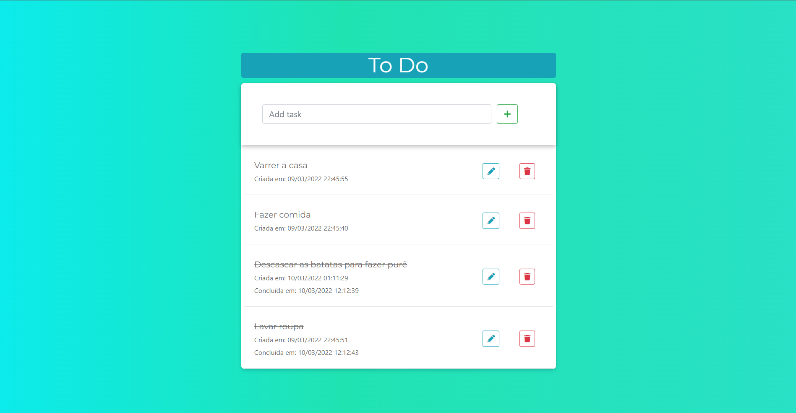

## To Do App - Gerenciador de Tarefas

Permite criar, editar, marcar como concluída e excluir tarefas.
Ordena as tarefas por situação e data de criação.

Back End criado com Django REST Framework, utilizando o Postman para testar
os endpoints.

Front End criado com Bootstrap e Vanilla JS, fazendo requisições à API usando 
```fetch()```.



### Endpoints:
```text
/api/task-list/ - Lista todas as Tarefas
/api/task-detail/<str:pk>/ - Visualiza uma Tarefa
/api/task-create/ - Cria uma Tarefa
/api/task-update/<str:pk>/ - Edita uma Tarefa
/api/task-delete/<str:pk>/ - Exclui uma Tarefa
```

### Tecnologias
- Django REST Framework
- HTML
- CSS
- JavaScript
- Bootstrap
- PostgreSQL
- Heroku


### Live Demo
[](https://todo-drf-vanillajs.herokuapp.com/)
###### Obs.: Como utilizo um servidor gratuito, pode demorar um pouco até o site abrir.