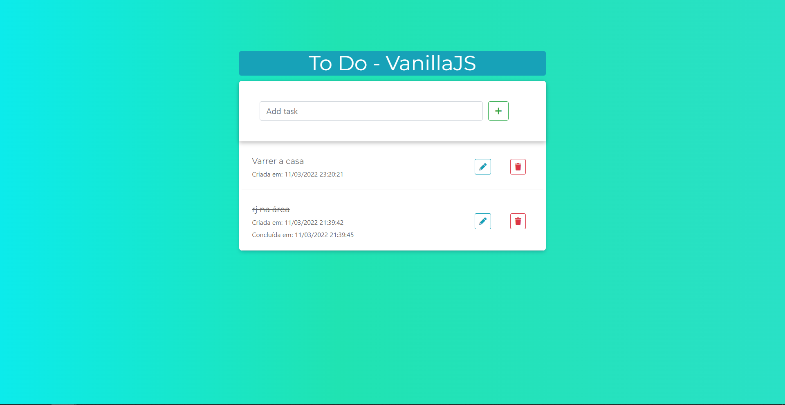
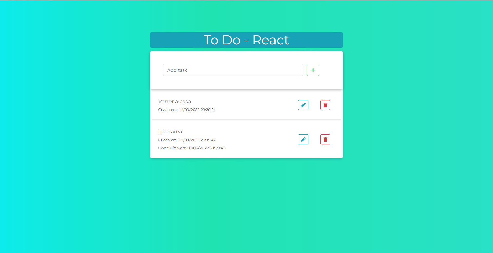

## To Do App - Gerenciador de Tarefas

Permite criar, editar, marcar como concluída e excluir tarefas. Ordena as tarefas por situação e data de criação.

### Back-end

Criado com Django REST Framework e PostgreSQL, utilizando o Postman para testar os endpoints.

### Front-end

- Uma versão criada com Bootstrap e Vanilla JS, fazendo requisições à API usando
  ```fetch()``` (https://todo-drf-vanillajs.herokuapp.com/)
  

- Outra versão foi desenvolvida com React, também usando ```fetch()``` (https://todo-drf-vanillajs.herokuapp.com/react/)
  

---

### Endpoints

Como a API é pública e não necessita de Autenticação, qualquer um pode fazer um request nos enpoints

```text
/api/task-list/ - Lista todas as Tarefas
/api/task-detail/<str:pk>/ - Visualiza uma Tarefa
/api/task-create/ - Cria uma Tarefa
/api/task-update/<str:pk>/ - Edita uma Tarefa
/api/task-delete/<str:pk>/ - Exclui uma Tarefa
```

Atributos do body da Requisição:

- title - string de 60 caracteres (obrigatório)
- completed - boolean (opcional)

---

### Tecnologias

- Django REST Framework
- PostgreSQL
- HTML
- CSS
- JavaScript
- Bootstrap
- React
- Git
- Heroku

---

### Live Demo

[](https://todo-drf-vanillajs.herokuapp.com/)

###### Obs.: Como utilizo um servidor gratuito, pode demorar um pouco até o site abrir.